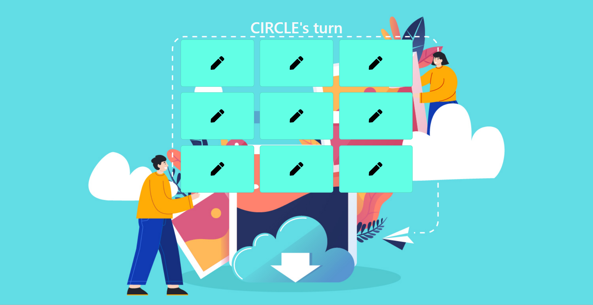

# Tic-Tac-Toe Game

## **Project: Creating Tic-Tac-Toe Game Using ReactJS**

### Concepts learned from this project:
- Learned about the Entire Tic-Tac-Toe Game logic.
- Learned about "useState" hook.
- Learned about order of adding CSS file .
- Learned about reactstrap , react-icons & react-toastify and how to add Toast Messages.
- Learned about adding animation using Animate-CSS.

**Deployed Link :** [Link]()
>### Preview :

